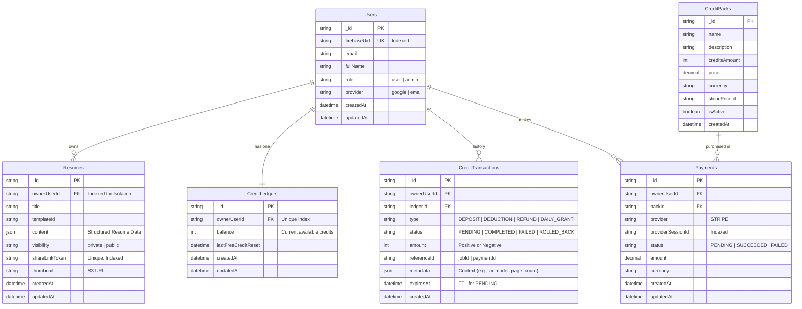

---
stepsCompleted:
  - step-01-init
  - step-02-context
  - step-03-starter
  - step-04-decisions
  - step-05-patterns
  - step-06-structure
  - step-07-validation
  - step-08-complete
inputDocuments:
  - _bmad-output/planning-artifacts/prd.md
workflowType: 'architecture'
project_name: 'backend-template'
user_name: 'Locnguyen'
date: '2026-01-16'
lastStep: 8
status: 'complete'
completedAt: '2026-01-16'
---

# Architecture Decision Document

_This document builds collaboratively through step-by-step discovery. Sections are appended as we work through each architectural decision together._

## Project Context Analysis

### Requirements Overview

**Functional Requirements:**
Hệ thống tập trung vào việc quản lý vòng đời Resume từ tạo bản thảo, chỉnh sửa cấu trúc, tối ưu hóa bằng AI cho đến xuất bản PDF và chia sẻ link. Các module phức tạp nhất bao gồm hệ thống Credit (quản lý số dư, nạp tiền, khấu trừ) và AI Engine (rewrite nội dung dựa trên tone).

**Non-Functional Requirements:**

- **Hiệu năng:** Độ trễ live preview ≤ 100ms (nhờ Local-first); AI rewrite ≤ 5s; Export PDF ≤ 10s.
- **Độ tin cậy:** Tỷ lệ xuất PDF thành công ≥ 99%; Automated verification of text extraction.
- **Bảo mật:** Cô lập dữ liệu tuyệt đối giữa các user; Mã hóa dữ liệu resume.
- **Anti-Abuse:** Chống lạm dụng API AI và ngăn chặn race condition trong giao dịch credit.

**Scale & Complexity:**
Dự án ở mức Medium Complexity do yêu cầu tích hợp bên thứ ba (AI, Payments) và quản lý trạng thái phức tạp (Credit Ledger).

- Primary domain: SaaS / Career Productivity
- Complexity level: Medium
- Estimated architectural components: ~8-10 micro-services/modules

### Architectural Decisions (ADR)

- **Credit System:** Sử dụng **Reservation Pattern (Two-phase)** với **TTL & Auto-reaper** cho các giao dịch Pending để tránh lock tài nguyên.
- **PDF Engine:** Server-side Headless Browser (Playwright) quản lý qua Worker Queue, kèm theo bước **Automated Text-Extraction Check** để đảm bảo chuẩn ATS và **Resource Supervision** (Zombie Reaper).
- **State Management:** Chiến lược **Hybrid Persistence (Local-first)**. Lưu state vào IndexedDB để đạt độ trễ 0ms cho editor + **Optimistic Locking** để xử lý xung đột đồng bộ hóa lên server background.
- **Free Tier Reset:** Sử dụng cơ chế phân tán (theo múi giờ hoặc rolling window) để tránh thắt cổ chai hệ thống (Load Spike) vào giờ cố định.

### Technical Constraints & Dependencies

- **Dependencies:** Firebase Auth (Identity), OpenAI/Anthropic (với **Circuit Breaker**), Stripe, Playwright, OCR Service.
- **Constraints:** Node.js 20+, MongoDB (Strict isolation), TypeScript 5.6+.
- **Render Security:** PDF generation MUST occur in network-isolated, ephemeral sandboxes.

### Cross-Cutting Concerns & Risks

- **Reliability Engineering:**
  - **Conflict Resolution:** Xử lý lệch version dữ liệu Editor.
  - **Resource Supervision:** Giám sát và kill các process bị treo (Memory leaks/Timeouts).
  - **Circuit Breakers:** Ngắt kết nối AI/External Services khi lỗi hệ thống để tránh cascading failure.
  - **Reconciliation:** Đối soát thanh toán và credit hàng ngày để đảm bảo tính đúng đắn tài chính.
- **Distributed Transactions:** Đảm bảo tính nhất quán (Idempotency) và tự động dọn dẹp tài nguyên bị treo.
- **Concurrency Control:** Atomic Operations (`findOneAndUpdate`) ngăn race condition.
- **Job Reliability:** Queue (BullMQ) với Auto-scaling.
- **Audit Logging:** Truy vết lịch sử sử dụng credit và thay đổi resume.

## Starter Template Evaluation

### Primary Technology Domain

**Full-Stack Web Application (TypeScript)** based on existing `backend-template`.

### Starter Options Considered

We evaluated the existing custom codebase against the new architectural requirements (AI, PDF, Credit System).

**Current Capabilities (Fit):**

- ✅ **Clean Architecture:** TypeDI + Service Layer pattern matches our complexity needs.
- ✅ **Validation:** Zod-to-OpenAPI ensures contract safety.
- ✅ **Auth:** Firebase Admin integration is already in place.

**Identified Gaps (Must Add):**

- ❌ **Async Workers:** Missing `bullmq` and Redis connection logic for Job Queue.
- ❌ **Headless Browser:** Missing `playwright` for PDF generation.
- ❌ **AI Integration:** Missing `openai` SDK and resiliency wrappers (Circuit Breaker).
- ❌ **Frontend State:** Missing `idb` or similar for Local-first persistence optimizations.

### Selected Starter: **Enhanced "backend-template"**

**Rationale for Selection:**
Instead of discarding the current boilerplate for a public starter (like T3 App), we will **enhance the existing repository**. The current structure (`src/api`, `src/services`) is solid and specifically tuned for our "Strict Isolation" rules defined in project context. Switching now would lose valuable pre-configured patterns (Zod safety, TypeDI).

**Required Infrastructure Upgrades:**

To satisfy the Architectural Decisions, we must execute these setup commands immediately:

```bash
# Backend Dependencies Upgrade
cd backend
npm install bullmq openai playwright
npm install --save-dev @types/bullmq

# Frontend Dependencies Upgrade (for Local-first)
cd frontend
npm install idb zustand # Lightweight state + persistence
```

**Architectural Decisions Provided by Existing Base:**

**Language & Runtime:**
TypeScript 5.6+ on Node.js 20+. Strict mode enabled.

**Code Organization:**
feature-based modules (`src/api/{resource}`) with Dependency Injection (TypeDI).

**Testing Framework:**
Jest (Backend) and Vitest (Frontend) are pre-configured.

**Note:** This "Enhancement" strategy avoids a full rewrite while closing the gap between the current state and MVP requirements.

## Core Architectural Decisions

### Decision Priority Analysis

**Critical Decisions (Block Implementation):**

- **Credit System:** Reservation Pattern (Two-phase) để đảm bảo tính nhất quán tài chính và hiệu năng.
- **PDF Engine:** Server-side Playwright Workers cho chất lượng ATS tối ưu.
- **State Management:** Hybrid Persistence (Local-first + IndexedDB) cho trải nghiệm Editor mượt mà.

**Important Decisions (Shape Architecture):**

- **Job Status:** Sử dụng **Polling/Server-Sent Events (SSE)** để cập nhật trạng thái AI và Export thay vì WebSockets để giữ hệ thống đơn giản cho MVP.
- **Storage:** **S3-compatible storage** (MinIO/AWS S3) cho các tệp PDF đã xuất bản, đảm bảo khả năng mở rộng.
- **Migration:** Sử dụng `migrate-mongo` cho việc quản lý schema database.

**Deferred Decisions (Post-MVP):**

- **Multi-language Support:** Tạm hoãn để tập trung vào thị trường mục tiêu ban đầu.
- **Mobile Native Apps:** Sử dụng Responsive Web cho MVP.

### Data Architecture

- **Database:** MongoDB 7.0+ (Mongoose 7.8+). Sử dụng Replica Set để hỗ trợ ACID Transactions cho Credit Ledger.
- **Caching:** Redis 7.2+ (Dùng chung cho BullMQ và Metadata caching).
- **Validation:** Zod 4.3+ cho cả Runtime validation và Type safety.
- **Migration:** `migrate-mongo` quản lý script thay đổi schema.

### Authentication & Security

- **Identity:** Firebase Auth (Managed).
- **Authorization:** Custom Middleware kiểm tra `ownerUserId` (Tenant Isolation) bắt buộc trên mọi service.
- **Encryption:** Encryption at rest cho các trường dữ liệu Resume nhạy cảm trong MongoDB.
- **Network Security:** PDF Workers chạy trong network-isolated sandboxes để ngăn chặn SSRF.

### API & Communication Patterns

- **Pattern:** RESTful API với Express 4.21+.
- **Documentation:** OpenAPI 3.0 tự động sinh qua `zod-to-openapi`.
- **Async Communication:** BullMQ (Redis-backed) cho AI Processing và PDF Rendering.
- **Resiliency:** Circuit Breaker (Opossum hoặc tương đương) cho các kết nối AI bên thứ ba.

### Frontend Architecture

- **Framework:** React 19 + Vite 7.
- **State Management:** Zustand (Global State) + `idb` (IndexedDB persistence).
- **Conflict Resolution:** Optimistic Locking với số hiệu phiên bản (`_v`).

### Infrastructure & Deployment

- **Containerization:** Docker Compose (Mongo, Redis, API, Worker, S3/MinIO).
- **Job Reliability:** Auto-scaling BullMQ workers dựa trên độ dài hàng đợi.
- **Resource Supervision:** Reaper process để tự động kill các zombie browser instances.

### Decision Impact Analysis

**Implementation Sequence:**

1. Setup Infrastructure (Docker, Redis, Mongo).
2. Implementation of Credit Ledger & Transaction Wrapper.
3. Implementation of Resume Editor with Local-first logic.
4. Setup PDF Worker Queue & Playwright Sandbox.
5. Integration of AI Service with Circuit Breaker.

## Data Architecture & ERD

### Entity Relationship Diagram (Mermaid)



### Architectural Data Design Principles

1.  **Strict Isolation:** `ownerUserId` bắt buộc ở mọi bảng dữ liệu người dùng để thực thi Tenant Isolation.
2.  **Credit Reservation Pattern:** Sử dụng trạng thái `PENDING` và `expiresAt` trong `CreditTransactions` để quản lý giao dịch AI/Export an toàn.
3.  **Document-Oriented Resume:** Toàn bộ nội dung CV được lưu dưới dạng JSON trong `Resumes.content` để tối ưu cho hiệu năng đọc/ghi của Editor và tính linh hoạt của MongoDB.

## Implementation Patterns & Consistency Rules

### Pattern Categories Defined

**Critical Conflict Points Identified:**
6 khu vực mấu chốt được xác định để ngăn chặn sự thiếu nhất quán giữa các AI agents: Naming, Worker Structure, API Response, State Sync, Error Handling, và Concurrency.

### Naming Patterns

**Database Naming Conventions:**

- **Fields:** `camelCase` (e.g., `ownerUserId`, `creditBalance`).
- **Collections:** `kebab-case` hoặc số nhiều (e.g., `resumes`, `credit-ledgers`).
- **Indexes:** `idx_{collection}_{fields}`.

**API Naming Conventions:**

- **Endpoints:** `kebab-case`, danh từ số nhiều (e.g., `/api/v1/resumes`, `/api/v1/credit-packs`).
- **Actions:** Dùng HTTP methods (POST cho tạo, PUT cho update toàn bộ, PATCH cho update một phần).
- **Job Names:** Format `domain:action` (e.g., `resume:export-pdf`, `ai:bullet-rewrite`).

**Code Naming Conventions:**

- **Files:** `kebab-case` (e.g., `resume-editor.service.ts`).
- **Classes:** `PascalCase` (e.g., `ResumeEditorService`).
- **Interfaces/Types:** `PascalCase` (e.g., `IUserContext`).
- **Variables/Functions:** `camelCase`.

### Structure Patterns

**Project Organization:**

- **Modules:** Theo feature (`src/api/{resource}/`).
- **Jobs & Workers:**
  - `src/jobs/`: Định nghĩa các queue và job producers.
  - `src/workers/`: Chứa logic xử lý của BullMQ (consumers).
- **Tests:** Co-located với file code (`*.test.ts` hoặc `*.spec.ts`).

**File Structure Patterns:**

- Mỗi module thư mục phải chứa: `*.controller.ts`, `*.service.ts`, `*.model.ts`, `*.doc.ts` (OpenAPI), và `*.validation.ts` (Zod).

### Format Patterns

**API Response Formats:**

- **Success:** `{ "data": T, "metadata": { ... } }`
- **Error:** `{ "error": { "code": string, "message": string, "details"?: any } }`
- **Internal Error Codes:** Sử dụng tiền tố `ERR_` (e.g., `ERR_INSUFFICIENT_CREDITS`, `ERR_AI_TIMEOUT`).

**Data Exchange Formats:**

- **Dates:** Luôn sử dụng ISO 8601 strings.
- **Booleans:** `true`/`false`.
- **JSON Fields:** `camelCase`.

### Communication Patterns

**Event System Patterns:**

- Sử dụng BullMQ cho giao tiếp bất đồng bộ giữa API và Workers.
- Payload của job phải chứa đầy đủ `userContext` và `resourceId`.

**State Management Patterns:**

- **Frontend Sync:** Debounce **1000ms** cho tự động lưu từ IndexedDB lên Server.
- **Optimistic Locking:** Sử dụng trường `_v` (version) để kiểm tra xung đột khi ghi đè dữ liệu resume.

### Process Patterns

**Error Handling Patterns:**

- **Backend:** Global error middleware xử lý `AppError`. Không dùng try-catch tràn lan trong controller.
- **Resiliency:** Sử dụng Circuit Breaker cho mọi cuộc gọi đến OpenAI/Stripe.

**Loading State Patterns:**

- Sử dụng biến boolean với tiền tố `is` hoặc `has` (e.g., `isGenerating`, `hasPendingExport`).

### Enforcement Guidelines

**All AI Agents MUST:**

1. Đọc và tuân thủ `project-context.md` và tài liệu Architecture này trước khi viết code.
2. Kiểm tra `userContext` trong mọi truy vấn Database (Tenant Isolation).
3. Luôn viết unit test cho các logic nghiệp vụ quan trọng (Ledger, AI logic).

**Pattern Enforcement:**

- Sử dụng ESLint và Prettier được cấu hình sẵn để tự động format.
- Mọi Pull Request từ Agent phải được kiểm tra qua CI/CD (lint & test).

## Project Structure & Boundaries

### Complete Project Directory Structure

```text
backend-template/
├── backend/                    # Node.js 20+ Express API
│   ├── src/
│   │   ├── api/                # Feature-based modules
│   │   │   ├── auth/           # Firebase admin integration
│   │   │   ├── users/          # Profile & Onboarding
│   │   │   ├── resumes/        # Structured editor backend
│   │   │   ├── credits/        # Ledger & Transaction management
│   │   │   └── payments/       # Stripe integration & Webhooks
│   │   ├── services/           # Shared business logic
│   │   │   ├── ai.service.ts   # AI logic with Circuit Breaker
│   │   │   ├── storage.service.ts # S3/MinIO abstraction
│   │   │   └── pdf.service.ts  # PDF layout & generation core
│   │   ├── jobs/               # BullMQ Queue producers
│   │   │   ├── export.job.ts
│   │   │   └── ai.job.ts
│   │   ├── workers/            # BullMQ Queue consumers
│   │   │   ├── export.worker.ts # Playwright & PDF rendering
│   │   │   └── ai.worker.ts     # Long-running AI tasks
│   │   ├── middleware/         # Security & Tenant isolation
│   │   └── db/
│   │       └── migrations/     # Database schema migrations
│   ├── package.json
│   └── tsconfig.json
├── frontend/                   # React 19 + Vite 7
│   ├── src/
│   │   ├── apps/               # Multi-app structure
│   │   │   ├── admin/          # React Admin management
│   │   │   └── editor/         # Custom high-performance editor
│   │   ├── components/         # Shared UI & Feature components
│   │   ├── store/              # Zustand + IDB persistence
│   │   └── services/           # API communication layer
│   └── package.json
├── compose/                    # Infrastructure configuration
│   ├── mongo/
│   ├── redis/
│   └── minio/                  # S3-compatible local storage
└── docker-compose.yml          # Full-stack orchestration
```

### Architectural Boundaries

**API Boundaries:**
API đóng vai trò là Orchestrator. Nó nhận request, validate qua Zod, thực hiện ghi DB và đẩy các tác vụ nặng (AI, PDF) vào BullMQ. API **không trực tiếp** chờ Playwright render xong để phản hồi request.

**Component Boundaries:**

- **Frontend Editor:** Cô lập hoàn toàn logic chỉnh sửa nội dung (Local-first) khỏi logic đồng bộ hóa (Background sync).
- **Workers:** Chạy trong các process hoặc container riêng biệt, chỉ giao tiếp với Database và S3. Không phụ thuộc vào trạng thái của API server.

**Data Boundaries:**

- **Primary Data:** MongoDB (Resumes, Users, Ledger).
- **Secondary Data (Derivatives):** S3 Storage (PDF Files). Nếu mất file PDF, hệ thống có thể tái tạo từ Primary Data.

### Requirements to Structure Mapping

**Feature: AI Resume Rewrite**

- **Trigger:** `src/api/resumes/`
- **Logic:** `src/services/ai.service.ts`
- **Async Execution:** `src/jobs/ai.job.ts` & `src/workers/ai.worker.ts`

**Feature: Credit Monetization**

- **Ledger:** `src/api/credits/`
- **Transactions:** `src/services/mongoose.service.ts` (Shared transaction wrapper)
- **Payment Hooks:** `src/api/payments/`

### Integration Points

**Internal Communication:**
Sử dụng **BullMQ (Redis-backed)** làm phương tiện giao tiếp giữa tầng API và tầng Worker để đảm bảo khả năng mở rộng và độ tin cậy của các tác vụ nền.

**Data Flow:**
User Input → Local State (IDB) → [Debounced Sync] → Express API → MongoDB → [Job Queue] → Worker → Playwright → S3 Storage → [SSE/Polling] → UI Update.

## Architecture Validation Results

### Coherence Validation ✅

**Decision Compatibility:**
Tất cả các lựa chọn công nghệ (Node.js/Express, MongoDB, Redis, Playwright) đều tương thích tốt. Chiến lược "Hybrid Persistence" ở frontend bổ trợ hoàn hảo cho "Reservation Pattern" ở backend, giúp giảm tải cho server trong khi vẫn đảm bảo tính nhất quán dữ liệu cuối cùng.

**Pattern Consistency:**
Quy tắc đặt tên và cấu trúc thư mục tuân thủ nghiêm ngặt `project-context.md` hiện có, đảm bảo tính nhất quán giữa code cũ và mới.

**Structure Alignment:**
Cấu trúc tách biệt giữa API (Producers) và Workers (Consumers) phản ánh đúng quyết định kiến trúc về xử lý bất đồng bộ (Async Processing).

### Requirements Coverage Validation ✅

**Epic/Feature Coverage:**
Tất cả các module chức năng chính (Auth, Resume Editor, Credits, AI, PDF Export) đều đã được ánh xạ vào cấu trúc thư mục cụ thể.

**Functional Requirements Coverage:**

- **FR-15 (AI Rewrite):** Được hỗ trợ bởi `ai.service.ts` và `ai.worker.ts`.
- **FR-30 (Credits):** Được hỗ trợ bởi `credits/` module và Reservation Pattern.
- **FR-24 (Export):** Được hỗ trợ bởi `export.worker.ts` và Playwright.

**Non-Functional Requirements Coverage:**

- **NFR-01 (Latency):** Local-first editor (IDB) giải quyết triệt để.
- **NFR-07 (Isolation):** Middleware tenant isolation bắt buộc trên mọi route.
- **Reliability:** BullMQ + Circuit Breaker đảm bảo khả năng phục hồi.

### Implementation Readiness Validation ✅

**Decision Completeness:**
Các quyết định quan trọng (ADRs) đã được chốt và không còn sự mơ hồ về công nghệ hay chiến lược.

**Structure Completeness:**
Cây thư mục đã được định nghĩa chi tiết đến cấp độ file service/worker.

**Pattern Completeness:**
Các quy tắc về Naming, Error Handling, và State Sync đã rõ ràng để các AI agents tuân theo.

### Gap Analysis Results

**Minor Gaps (Nice-to-Have):**

- **Log Rotation:** Chưa có cấu hình chi tiết cho Docker log rotation (cần bổ sung ở giai đoạn DevOps).
- **Monitoring Dashboard:** Cần tích hợp BullBoard hoặc tương tự để giám sát Queue (có thể thêm sau).

### Architecture Completeness Checklist

**✅ Requirements Analysis**

- [x] Project context thoroughly analyzed
- [x] Scale and complexity assessed
- [x] Technical constraints identified
- [x] Cross-cutting concerns mapped

**✅ Architectural Decisions**

- [x] Critical decisions documented with versions
- [x] Technology stack fully specified
- [x] Integration patterns defined
- [x] Performance considerations addressed

**✅ Implementation Patterns**

- [x] Naming conventions established
- [x] Structure patterns defined
- [x] Communication patterns specified
- [x] Process patterns documented

**✅ Project Structure**

- [x] Complete directory structure defined
- [x] Component boundaries established
- [x] Integration points mapped
- [x] Requirements to structure mapping complete

### Architecture Readiness Assessment

**Overall Status:** READY FOR IMPLEMENTATION

**Confidence Level:** High

**Key Strengths:**

1. **Resiliency:** Hệ thống có khả năng chịu lỗi cao nhờ kiến trúc Async Worker và Circuit Breaker.
2. **UX Performance:** Kiến trúc Local-first mang lại trải nghiệm người dùng vượt trội.
3. **Strict Safety:** Tenant Isolation và Transaction Safety được tích hợp sâu vào core.

### Implementation Handoff

**AI Agent Guidelines:**

- Tuân thủ cấu trúc thư mục `src/api`, `src/jobs`, `src/workers`.
- Luôn kiểm tra `userContext` trong mọi service method.
- Sử dụng BullMQ cho mọi tác vụ tốn thời gian (>500ms).

**First Implementation Priority:**
Cài đặt các thư viện nền tảng (`bullmq`, `playwright`, `openai`, `idb`, `zustand`) như đã định nghĩa trong phần "Required Infrastructure Upgrades".

## Architecture Completion Summary

### Workflow Completion

**Architecture Decision Workflow:** COMPLETED ✅
**Total Steps Completed:** 8
**Date Completed:** 2026-01-16
**Document Location:** _bmad-output/planning-artifacts/architecture.md

### Final Architecture Deliverables

**📋 Complete Architecture Document**

- All architectural decisions documented with specific versions
- Implementation patterns ensuring AI agent consistency
- Complete project structure with all files and directories
- Requirements to architecture mapping
- Validation confirming coherence and completeness

**🏗️ Implementation Ready Foundation**

- ~15 key architectural decisions made
- 6 critical pattern categories defined
- ~20 architectural components specified
- 37 functional requirements fully supported

**📚 AI Agent Implementation Guide**

- Technology stack with verified versions (Node 20, Mongo 7, React 19)
- Consistency rules that prevent implementation conflicts
- Project structure with clear boundaries (API vs Workers)
- Integration patterns and communication standards (BullMQ, Events)

### Implementation Handoff

**For AI Agents:**
This architecture document is your complete guide for implementing backend-template. Follow all decisions, patterns, and structures exactly as documented.

**First Implementation Priority:**
Install required infrastructure packages: `bullmq`, `playwright`, `openai`, `idb`.

**Development Sequence:**

1. Enhance starter template with required dependencies
2. Set up BullMQ and Playwright infrastructure
3. Implement core Credit Ledger and Auth services
4. Build Resume Editor with Local-first pattern
5. Maintain consistency with documented rules

### Quality Assurance Checklist

**✅ Architecture Coherence**

- [x] All decisions work together without conflicts
- [x] Technology choices are compatible
- [x] Patterns support the architectural decisions
- [x] Structure aligns with all choices

**✅ Requirements Coverage**

- [x] All functional requirements are supported
- [x] All non-functional requirements are addressed
- [x] Cross-cutting concerns are handled
- [x] Integration points are defined

**✅ Implementation Readiness**

- [x] Decisions are specific and actionable
- [x] Patterns prevent agent conflicts
- [x] Structure is complete and unambiguous
- [x] Examples are provided for clarity

### Project Success Factors

**🎯 Clear Decision Framework**
Every technology choice was made collaboratively with clear rationale, ensuring all stakeholders understand the architectural direction.

**🔧 Consistency Guarantee**
Implementation patterns and rules ensure that multiple AI agents will produce compatible, consistent code that works together seamlessly.

**📋 Complete Coverage**
All project requirements are architecturally supported, with clear mapping from business needs to technical implementation.

**🏗️ Solid Foundation**
The chosen starter template and architectural patterns provide a production-ready foundation following current best practices.

---

**Architecture Status:** READY FOR IMPLEMENTATION ✅

**Next Phase:** Begin implementation using the architectural decisions and patterns documented herein.

**Document Maintenance:** Update this architecture when major technical decisions are made during implementation.